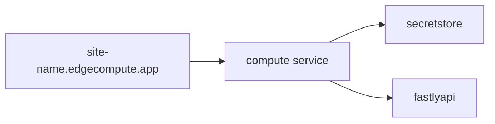

# what is this

# what does it do
- deploys a javascript compute@edge application that uses geoip data, a secret-store, and makes an api call

# diagram

# pre-reqs
- a fastly account with the following feature flags enabled
  - `secret_store`
  - also, you must navigate to the compute tab in the fastly web interface and enable your compute trial, if you haven't already, by deploying any compute service

# howto
## first time setup
chose one of the following three options for where to run this from

### option 1 - a github codespace
- click the green "Code" button at the top of the github repo
- click the Codespaces tab within the modal
- click the green "Create codespace..." button
- watch and wait for it to setup (takes ~5m)

### option 2 - locally using vscode with a devcontainer
- install the devcontainer extension in vscode
- open this folder in the devcontainer
- wait for it (takes ~5m)
- open another terminal to work in

### option 3 - install dependencies on an M1/M2 mac with homebrew
[click here ](README.mac-arm.md)

### configure authentication(s)
- create a fastly api token for your user ([creating api tokens](https://docs.fastly.com/en/guides/using-api-tokens#creating-api-tokens))
- configure the fastly cli with it   
    `fastly profile create`  
- click on the file named `terraform.tfvars` in the left menu and populate its values
  - use the same fastly api key from the cli (`fastly profile token`)

## test loop
- `terraform apply`
- click the link
- `terraform destroy`

## cleanup (if using codespaces)
- in the same github web modal that you created the codespace you will now see it listed with a random name
- click the "..." next to it
- click Delete